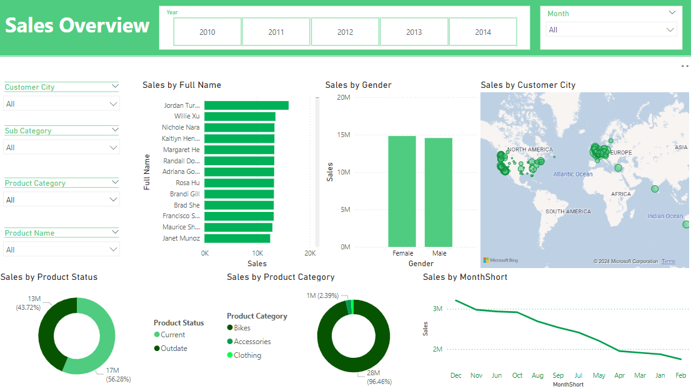

# Sales Interactive Dashboard

An end-to-end Power BI analytics project built from the AdventureWorksDW2022 data warehouse. The project extracts sales, customer, product, calendar, and budget data; models it as a star schema; and publishes an interactive sales dashboard through GitHub Pages.

## Live Dashboard

[Open the published dashboard](https://mazen-yacoub.github.io/Sales-interactive-dashboard/)

## Project Objectives

- Track internet sales performance across time, products, customers, and geography.
- Compare actual sales with budget targets.
- Identify high-performing product categories, subcategories, customers, and locations.
- Package the project in a clean, reviewable structure for portfolio and analytics presentation use.

## Key Insights

- Bikes drive nearly all revenue, with Road Bikes and Mountain Bikes as the strongest subcategories.
- Sales are broadly balanced by customer gender.
- Revenue is geographically distributed, with strong city-level performance in London, Paris, and several Australian cities.
- Late-year months show stronger seasonal performance, especially October through December.
- Outdated products still contribute a meaningful share of revenue, which may require product lifecycle review.

## Repository Structure

```text
.
├── assets/
│   └── images/              # Dashboard, model, and SQL workflow screenshots
├── data/
│   ├── budget/              # Budget source workbook
│   └── raw/                 # Extracted CSV source tables
├── docs/                    # Supporting documentation
├── powerbi/                 # Power BI report file
├── sql/                     # SQL extraction scripts
├── index.html               # GitHub Pages landing page
└── README.md
```

## Data Sources

- `AdventureWorksDW2022` SQL Server database
- Budget workbook: [sales_budget.xlsx](data/budget/sales_budget.xlsx)

Extracted tables:

- [fact_internet_sales.csv](data/raw/fact_internet_sales.csv)
- [dim_calendar.csv](data/raw/dim_calendar.csv)
- [dim_customer.csv](data/raw/dim_customer.csv)
- [dim_product.csv](data/raw/dim_product.csv)

## SQL Extraction Scripts

- [fact_internet_sales.sql](sql/fact_internet_sales.sql)
- [dim_calendar.sql](sql/dim_calendar.sql)
- [dim_customer.sql](sql/dim_customer.sql)
- [dim_product.sql](sql/dim_product.sql)

## Power BI Report

The report file is available at [powerbi/customer_analysis.pbix](powerbi/customer_analysis.pbix).

The model uses a star schema:

- Fact table: Internet sales
- Supporting fact table: Budget
- Dimensions: Calendar, Customer, Product

## Dashboard Preview



## Tools Used

- SQL Server
- Power BI
- Excel
- GitHub Pages
